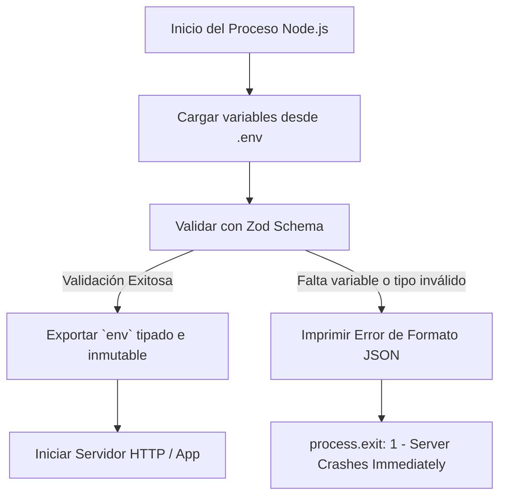

# Buenas Prácticas Base (ESLint, Prettier, .env & Zod)

> **Objetivo del módulo:** Dominar la configuración e integración de estándares de código (ESLint, Prettier), control de secretos y validación estricta de variables de entorno con Zod en Node.js aplicando el patrón _Fail Fast_.

---

## ▶️ Panorámica rápida

- 📌 **Linter vs Formatter:** ESLint detecta errores sintácticos y antipatrones de ejecución; Prettier unifica la estética del código sin alterar la AST.
- 📌 **Fail Fast en Configuración:** Si una variable de entorno requerida (ej. `PORT`, `DATABASE_URL`) no existe o es inválida, el servidor debe abortar inmediatamente en tiempo de arranque.
- 📌 **Seguridad de Secretos:** NUNCA subas archivos `.env` a repositorios git. Mantén siempre un `.env.example` sincronizado como contrato de configuración.
- 📌 **Flat Config de ESLint:** Node.js y ESLint v9+ usan el nuevo estándar `eslint.config.mjs` basado en módulos ESM nativos.

---

## 🧠 Analogía / Explicación Feynman

Imagina que estás construyendo un avión comercial:

- **ESLint** es el ingeniero de seguridad que revisa que las turbinas no tengan tornillos sueltos o cables desconectados (evita desastres en vuelo).
- **Prettier** es el pintor que asegura que todo el fuselaje tenga el mismo color y acabado impecable.
- **Zod + `.env`** es la lista de chequeo de combustible pre-vuelo: si falta el combustible de aviación (`DATABASE_URL`), el avión ni siquiera enciende los motores. No quieres descubrir que no hay combustible cuando ya estés a 10,000 metros de altura (en producción).

---

## 📊 Diagrama de Flujo / Arquitectura



---

## 📑 Conceptos Clave & Trampas Mentales

| Concepto                                 | Clave práctica                                                                                          | Antipatrón / Trampa común                                                                                                   |
| ---------------------------------------- | ------------------------------------------------------------------------------------------------------- | --------------------------------------------------------------------------------------------------------------------------- |
| **ESLint vs Prettier**                   | ESLint para _Code Quality_ (reglas de JS/TS). Prettier para _Formatting_ (comas, comillas, sangría).    | Mezclar reglas de formato dentro de ESLint creando conflictos con Prettier. Usa `eslint-config-prettier`.                   |
| **Variables de Entorno (`process.env`)** | `process.env` siempre devuelve valores tipo `string \| undefined`.                                      | Asumir que `process.env.PORT` es un `number` o usar `process.env.DB_PASS!` con non-null assertion sin validar.              |
| **Contrato `.env.example`**              | Plantilla pública versionada en Git con claves sin secretos reales (`PORT=3000`, `DB_HOST=localhost`).  | Commitear el archivo `.env` real a GitHub exponiendo credenciales de bases de datos o llaves de Stripe.                     |
| **Patrón Fail Fast**                     | Validar la configuración en `src/config/env.ts` antes de instanciar cualquier servicio o base de datos. | Dejar que la aplicación arranque y falle 10 minutos después cuando un usuario ejecute una ruta que use la API key faltante. |

---

## ⚡ Buenas prácticas

- **Prefiere:** Usar `Zod` para castear y validar tipos de variables de entorno (`z.coerce.number()`, `z.string().url()`).
- **Prefiere:** La nueva Flat Config de ESLint (`eslint.config.mjs`) sobre el archivo legado `.eslintrc.json`.
- **Evita:** Usar `process.env.VARIABLE` directamente a lo largo de tu código fuente; importa siempre un objeto validado `env`.
- **Usa con precaución:** Scripts de despliegue sin validación de sintaxis previa (`npm run lint && npm run build`).

---

## 🛠️ Ejemplo guiado

A continuación construimos la arquitectura completa de configuración e inspección para un proyecto Node.js profesional con TypeScript.

### 1. Esquema de Validación de Entorno (`src/config/env.ts`)

```typescript
import { z } from 'zod';

const envSchema = z.object({
  NODE_ENV: z
    .enum(['development', 'production', 'test'])
    .default('development'),
  PORT: z.coerce.number().default(3000),
  DATABASE_URL: z
    .string()
    .url({ message: 'DATABASE_URL debe ser una URI válida' }),
  API_SECRET: z
    .string()
    .min(16, { message: 'API_SECRET debe tener al menos 16 caracteres' }),
});

const parseEnv = () => {
  const result = envSchema.safeParse(process.env);

  if (!result.success) {
    console.error('❌ Error crítico en variables de entorno:');
    console.error(JSON.stringify(result.error.format(), null, 2));
    process.exit(1);
  }

  return result.data;
};

export const env = parseEnv();
```

### 2. Configuración de ESLint (`eslint.config.mjs`)

```javascript
import eslint from '@eslint/js';
import tseslint from 'typescript-eslint';
import prettierConfig from 'eslint-config-prettier';

export default tseslint.config(
  eslint.configs.recommended,
  ...tseslint.configs.recommended,
  prettierConfig,
  {
    ignores: ['dist/', 'node_modules/', 'coverage/'],
  },
  {
    rules: {
      '@typescript-eslint/no-explicit-any': 'error',
      '@typescript-eslint/explicit-function-return-type': 'warn',
      'no-console': ['warn', { allow: ['warn', 'error', 'info'] }],
    },
  }
);
```

### 3. Configuración de Prettier (`.prettierrc`)

```json
{
  "semi": true,
  "singleQuote": true,
  "tabWidth": 2,
  "trailingComma": "es5",
  "printWidth": 100
}
```

### 🏷️ Puntos a notar:

1. **`z.coerce.number()`**: Convierte automáticamente el string `"3000"` de `process.env.PORT` a un `number` tipado en TypeScript.
2. **`safeParse` vs `parse`**: `safeParse` nos permite capturar los errores formateados de Zod e imprimir un reporte legible en consola antes de ejecutar `process.exit(1)`.
3. **Exportación inmutable de `env`**: Al importar `import { env } from '@/config/env'`, TypeScript garantiza autocompletado y tipado 100% estricto sin valores `undefined`.

---

## 🎯 Reto (20 min) - Práctica de Generación

1. **Crear archivo `.env` local:**
   Agrega una variable `JWT_SECRET=corta` (menos de 16 caracteres) y ejecuta tu aplicación.
2. **Observar el crash de tiempo de arranque:**
   Verifica que la aplicación aborte de inmediato e imprima el error indicando que `JWT_SECRET` debe tener al menos 16 caracteres.
3. **Corregir y validar:**
   Corrige el valor en `.env`, arranca la app y confirma que `env.PORT` sea un número nativo en lugar de una cadena.

---

## ✅ Checklist de Active Recall

- [ ] ¿Puedo explicar la diferencia entre las responsabilidades de ESLint y Prettier?
- [ ] ¿Por qué es un antipatrón acceder a `process.env` directamente en los controladores o servicios?
- [ ] ¿Qué ventaja ofrece `z.coerce` al validar variables de entorno en Node.js?
- [ ] Sin mirar el código, ¿puedo escribir la estructura del patrón _Fail Fast_ con `safeParse` y `process.exit(1)`?

## ❓ Flashcards rápidas

- **P: ¿Qué ocurre si ejecutas un servidor Node.js sin validar su .env en el inicio?**  
  _R:_ Riesgo de que la app arranque y falle horas o días después en producción al intentar acceder a un servicio o base de datos (_Fail Late_ en lugar de _Fail Fast_).
- **P: ¿Por qué no debemos definir reglas de formato estético dentro de ESLint?**  
  _R:_ Porque crean conflictos con Prettier. ESLint debe centrarse en la calidad de código (_code quality_) y Prettier en el formateo (_formatting_).
- **P: ¿Cómo garantiza Zod que `process.env.PORT` no sea un string en TypeScript?**  
  _R:_ Mediante `z.coerce.number()`, que parsea y transforma automáticamente la cadena a un valor de tipo `number`.
