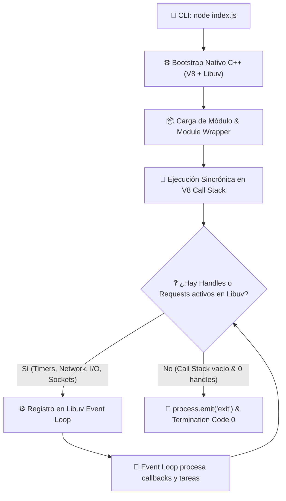

# Ciclo de ejecución de un script en Node.js

> **Objetivo del módulo:** Comprender de principio a fin el proceso interno que ocurre desde que se ejecuta `node index.js` en la terminal hasta la terminación del proceso o la entrada al bucle de eventos (Event Loop).

---

## ▶️ Panorámica rápida

- Node.js inicia ejecutando su binario nativo en C++, inicializando las estructuras del motor V8 y la biblioteca de I/O asíncrono Libuv.
- Parsea el archivo de entrada (`index.js`), lo envuelve en un _Module Wrapper_ (CommonJS) o invoca el _ESM Loader_ (ECMAScript Modules) e inicia la ejecución sincrónica en el Call Stack de V8.
- Si durante la ejecución sincrónica se registran callbacks, eventos o llamadas I/O asíncronas, se delegan a Libuv y el proceso se mantiene en ejecución.
- Cuando el Call Stack se vacía y Libuv confirma que no existen _handles_ o _requests_ pendientes, el proceso finaliza emitiendo el evento `exit` y retornando el código de salida al sistema operativo.

---

## 🧠 Explicación Feynman

Imagina a Node.js como un chef en una cocina (el hilo único de V8). El chef recibe una receta (`index.js`) y ejecuta inmediatamente todos los pasos directos (picar verduras, sazonar) en su mesa de trabajo (Call Stack). Si un paso requiere tiempo externo (hornear un pastel durante 30 minutos), se lo encarga a un timer de cocina automático (Libuv) y continúa leyendo el resto de la receta. Cuando la receta síncrona termina y no quedan timbres de cocina ni pedidos pendientes, el chef limpia la mesa, apaga la cocina y se retira.

---

## 📊 Arquitectura del Ciclo de Ejecución (Dual Coding)



---

## 📑 Conceptos Clave & Trampas Mentales

| Concepto                | Clave práctica                                                                                                        | Antipatrón / Trampa común                                                                                        |
| ----------------------- | --------------------------------------------------------------------------------------------------------------------- | ---------------------------------------------------------------------------------------------------------------- |
| **Bootstrap C++**       | Node.js arranca componentes nativos (`node_main.cc`, V8, Libuv) antes de interpretar una sola línea de JS.            | Creer que Node.js es JavaScript puro; en realidad es un ejecutable C++ que aloja el motor V8.                    |
| **Module Wrapping**     | En CommonJS, Node envuelve todo script en `(function(exports, require, module, __filename, __dirname) { ... })`.      | Pensar que `require` o `__dirname` son variables globales de JS; son argumentos inyectados por el wrapper.       |
| **RefCount de Libuv**   | El proceso se mantiene vivo únicamente si el contador de _handles_ (servidores, timers) o _requests_ es mayor a cero. | Asumir que un script se detiene solo por llegar al final del archivo sin cerrar conexiones a DB o `setInterval`. |
| **Top-Level Execution** | Todo el código fuera de callbacks o promesas se ejecuta de forma 100% bloqueante al iniciar el script.                | Pensar que colocar `fs.readFileSync` al inicio no afecta el arranque inicial de la aplicación.                   |

---

## ⚡ Buenas prácticas

- **Prefiere** realizar inicializaciones sincrónicas únicamente durante la fase de bootstrap (ej. cargar variables de entorno o leer configuraciones al arrancar la app).
- **Evita** utilizar funciones de I/O sincrónicas (`fs.readFileSync`, `child_process.execSync`) una vez que el servidor o la aplicación esté atendiendo tráfico en el Event Loop.
- **Usa con precaución** `process.exit()` de forma abrupta; prefiere permitir que el ciclo de vida finalice naturalmente o implementa un _graceful shutdown_ cerrando adecuadamente todos los _handles_ activos.

---

## 🛠️ Ejemplo guiado

```typescript
import { setTimeout } from 'node:timers/promises';

console.log('1️⃣ [Bootstrap/Sync] Inicio de ejecución síncrona');

// 1. Registro de callback asíncrono (Timer handle en Libuv)
setTimeout(100).then(() => {
  console.log('4️⃣ [Async Callback] Timer de Libuv completado a los 100ms');
});

// 2. Registro de Microtask en V8 (Promise Job Queue)
Promise.resolve().then(() => {
  console.log(
    '3️⃣ [Microtask] Promesa resuelta (ejecutada inmediatamente tras vaciar el Call Stack)'
  );
});

console.log('2️⃣ [Sync] Fin del bloque síncrono principal');
```

### 🏷️ Puntos a notar:

1. Las líneas `1️⃣` y `2️⃣` se ejecutan consecutivamente en el Call Stack síncrono de V8 de forma totalmente bloqueante.
2. Al vaciarse el Call Stack síncrono, V8 procesa la cola de **Microtasks** (línea `3️⃣`) antes de ceder el control a Libuv.
3. El proceso no termina tras la línea `2️⃣` porque el timer de 100ms mantiene un _handle_ activo en Libuv, permitiendo que el Event Loop procese la línea `4️⃣` antes de finalizar.

---

## 🎯 Reto (20 min) - Práctica de Generación

1. Escribe un script en TypeScript (`lifecycle-challenge.ts`) que contenga:
   - Un `console.log` síncrono inicial y uno final.
   - Un `process.nextTick()`.
   - Una `Promise.resolve().then()`.
   - Un `setTimeout()` con 0ms.
   - Un `fs.readFile()` leyendo un archivo local pequeño.
2. **Sin ejecutar el código**, escribe en un papel o comentario la secuencia exacta esperada de salida en consola.
3. Ejecuta el script usando `npx tsx lifecycle-challenge.ts` y compara el resultado real con tu predicción.
4. ¿Ocurrió alguna discrepancia entre la microtarea de `process.nextTick` y la de `Promise`? Explica por qué.

---

## ✅ Checklist de Active Recall

- [ ] Sin mirar la nota, ¿puedo explicar qué componentes se inicializan en la fase de Bootstrap en C++ antes de ejecutar JS?
- [ ] ¿Sé cuáles son los 5 argumentos que el _Module Wrapper_ de CommonJS inyecta silenciosamente a mi código?
- [ ] ¿Puedo describir la regla por la cual Libuv decide mantener un proceso de Node.js vivo o permitir que finalice?
- [ ] ¿Comprendo la diferencia de prioridad de ejecución entre el bloque síncrono inicial, la cola de Microtasks y las fases del Event Loop?

---

## ❓ Flashcards rápidas

- **¿Qué determina la terminación de un proceso Node.js?**
  Que el V8 Call Stack esté vacío **Y** que el conteo de _handles/requests_ activos en Libuv sea igual a 0.
- **¿Cuál es el siguiente tema sugerido para profundizar en la arquitectura interna?**
  [[01-motor-v8|Motor V8 a fondo: Call Stack, Memory Heap y JIT Compiler]]
